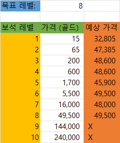
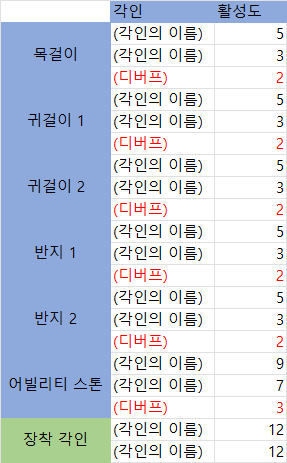

개인 프로젝트 - LOA Mini Calculator
===============   
## 목차
1. [프로젝트 계획 이유](#프로젝트-계획-이유)
2. [기능 설계](#기능-설계)
3. [Daily Log](#daily-log)

-------

## 프로젝트 계획 이유
`로스트아크` 게임을 하면서, 캐릭터를 강하게 만들기 위해서 여러 세팅들을 한다. 이 때 다양한 계산과 메모를 하게 되는데, 이 내용들을 나중에 볼 수 있게 저장하는 것 또는 계산 자체를 어려워하는 친구들이 있었다. 따라서 나는 엑셀을 이용하여 간단한 계산 템플릿을 만들어 같이 게임을 하는 친구들에게 배포하였다.    

그러나 약간의 '진입 장벽'이 있는 엑셀이라는 프로그램의 특성 상 엑셀을 다룰 줄 몰라 이 계산기를 사용하기 힘들어하는 친구도 있었고, 누구나 수정을 할 수 있다는 점이 오히려 단점으로 작용해 제작 당시의 나의 의도 대로 사용하지 않다가 계산이 아예 틀어져버리거나 이 망가진 계산 템플릿을 재배포하는 과정에서 손해를 보는 친구도 있었다.   

따라서 어느 정도 계산기의 형태가 완성되어 더 이상 버그 수정이나 기능 업데이트를 하지 않는 지금, 안드로이드 실습 겸 이 엑셀 계산기를 스마트폰에서 이용할 수 있도록 어플리케이션(이하 앱)으로 제작해보고자 한다.    

2022-02-08 eastdh    

---
## 기능 설계
1. 메인 화면
    > **메인 화면**은 사용자가 앱을 실행시켰을 때 가장 처음 보게되는 화면이다.
    -  사용자는 **메인 화면**에서 `제작`, `보석`, `각인` 버튼을 이용해 해당 메뉴의 화면으로 이동할 수 있다.
    - 화면의 우하단에서 `도움말(? 모양)`버튼을 클릭하면 해당 화면의 사용법과 게임에서의 적용법을 알 수 있다.
        > 이 `도움말`버튼은 하위 메뉴에서도 해당 메뉴의 사용법을 얻기 위해 이용할 수 있다.
    - 화면의 좌상단에서 `종료(X 모양)`버튼을 클릭하면 앱을 종료한다.
        > 하위 메뉴에서는 해당 자리에 `종료`버튼을 대신해 `메인 메뉴(집 모양)`버튼이 위치하게 된다.
1. 제작 계산기
    > **제작 계산기**는 '원정대 영지'에서 '제작' 기능을 통해 생산한 물품을 거래소에 판매했을 때 어느 정도의 이득을 얻을 수 있는지 계산하는 기능이다. 
    - 추가 예정
    - 제작 계산기는 현재 '하/중/상급 오레하 융화 재료'에 대한 계산만 제공한다.    
     추후 추가할 기능의 후보는 다음과 같다.
        - 차트 기능   
             사용자가 게임 내 거래소에서 '하/중/상급 오레하 융화 재료'의 '전일 평균 거래가'를 검색해서 입력하면 입력 당시 기준 하루 전 날짜로 데이터가 저장되고, 이 데이터들로 차트를 그린다. 사용자는 조회 기간(30일, 7일)을 선택해서 차트를 볼 수 있다. 사용자가 직접 매일 데이터를 입력해야한다는 단점이 존재하므로 누락된 데이터에 대해서 다른 사용자에게 받아 올 수 있는 방법을 추가할 수 있을 것이다.
        - 빈 표 추가 기능   
             사용자가 다른 물품에 대해서도 표를 만들 수 있도록 빈 표를 추가하는 기능을 만든다. 추가할 수 있는 표의 최대 개수를 설정해야 할 것이고, 작은 스마트폰의 화면으로도 수 많은 표들을 편하게 볼 수 있게 UI가 정리되어야 할 것이다. 또, 빈 표에 사용자가 직접 입력할 자료가 _물품 이름 / 재료 수급 방법 / 재료 이름 / 재료 개수 / 1회 제작당 생산 개수 / 제작 비용 / 거래소 가격_ 으로 총 7가지 이므로 사용자의 실수로 인해 계산 결과가 아예 달라질 수 있다. 이를 방지하기 위해서는 생산 후 판매 가능한 모든 물품의 레시피를 제공해야 할 것이다.
    
2. 보석 계산기   
    > **보석 계산기**는 어떤 레벨의 보석을 구매해야 목표 보석 레벨에 가장 저렴하게 도달하는지 계산하는 기능이다.   
    - 메인 화면에서 `보석`버튼을 클릭하면 이 메뉴로 이동한다.
    - 화면 상단에서 `목표 보석 레벨`을 설정한다.
        > 이 숫자는 10 이하의 자연수만 허용한다.
    - 화면 중단에서 `각 레벨의 보석의 가격`을 _**사용자가 직접 경매장에서 검색해서**_ 입력한다.
        > 22년 2월 현재 게임을 직접 켜서 확인하는 방법 외에는 거래소/경매장 검색은 불가능하다.
    - 각 레벨의 가장 오른쪽 열에서 `예상 소모 골드`를 확인할 수 있다. 골드 계산식은 다음과 같다.
        > (예상 소모 골드) = (보석의 가격) * 3^[(목표 보석 레벨) - (보석 레벨)]   
    - 화면 우상단의 `초기화(돌아가는 화살표 모양)`버튼을 통해 `목표 보석 레벨`과 `각 레벨의 보석의 가격`을 전부 공란으로 설정할 수 있다.
    - 완성된 **보석 계산기**의 대략적인 형태는 다음과 같을 것이다.   
    
3. 각인 계산기
    > **각인 계산기**는 장신구, 어빌리티 스톤, 장착 각인을 통해 얻을 수 있는 각인을 계산하여 사용자의 장신구 세팅에 도움을 주는 기능이다.
    - 메인 화면에서 `각인`버튼을 클릭하면 이 메뉴로 이동한다.
    - 화면 우상단의 `추가(+ 모양)` 버튼 클릭 시 새로운 표(**각인 표**)가 표 목록 최하단에 생성된다.
        >이 표는 최대 6개까지 생성 가능하다.
    - 각 **각인 표**의 `설정(톱니 모양)`버튼 클릭 시 직접 세팅을 할 수 있는 표(**장신구 표**)가 **각인 표** 아래에 펼쳐진다.    
     `설정`버튼을 다시 클릭하면 펼쳐진 **장신구 표**가 접힌다.
    - `설정`버튼 옆의 `삭제(X 모양)`버튼을 클릭하면 확인 메시지를 띄운 후 **각인 표**를 삭제한다.
    - **각인 표**의 내용은 다음과 같다.
        - 첫 번째 행에 직업을 선택하는 칸과 제목 겸 한줄 메모를 적을 수 있는 칸이 표시된다.
        - 표의 내용은 활성화 된 각인의 이름과 레벨, 초과된 활성도를 표시한다.    
         만약 디버프가 활성화 된다면, 그 디버프는 **각인 표**의 최하단에 표시한다.   
         이 때, 레벨은 활성도에 따라 결정된다.       
            > 활성도 0 \~ 4: Lv. 0   
            > 활성도 5 \~ 9: Lv. 1      
            > 활성도 10 \~ 14: Lv. 2   
            > 활성도 15 \~ : Lv. 3
        - 완성된 **각인 표**의 대략적인 형태는 다음과 같을 것이다.   
        
    - **장신구 표**의 내용은 다음과 같다.
        - 장신구의 각 부위별로 각인과 활성화 정도를 설정할 수 있다.
        - 이 때 각인의 이름은 드롭다운 메뉴를 통해 선택할 수 있게 한다.
            > 이 메뉴는 선택한 직업의 '직업 각인' 두 개를 최상위에 두고 이하에 '전투 각인'을 가나다 순으로 정렬한다.   
        - 각인의 활성화 정도는 직접 숫자를 입력하도록 한다.
            > 이 숫자는 0을 포함한 10 이하의 자연수만 허용한다.
        - 완성된 **장신구 표**의 대략적인 형태는 다음과 같을 것이다.   
        

- 추가 예정   

---
## Daily Log
> TIL이나 개발 일지 등 그 날의 진행 상황   

**2022-02-07**    
    프로젝트 주제 선정, 간략한 UI설정    

**2022-02-08**    
    `README.md` 개요 작성, [TableLayout 사용법](https://www.youtube.com/watch?v=DkxPfcIyoRg "YouTube")  학습    

**2022-02-09**   
    각 [기능 설계](#기능-설계)의 세부적인 설계 작성

**2022-02-11**   
    UI수정, FloatingActionButton 사용법 학습 - hint 버튼 등에 활용   
    [상단바 (Toolbar) 사용법](https://game-happy-world.tistory.com/11 "tistory") 학습

